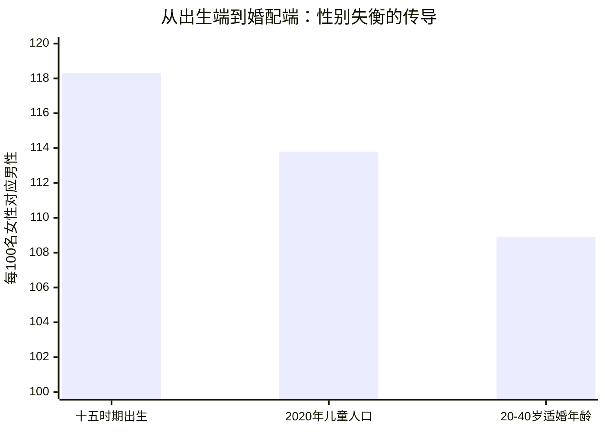
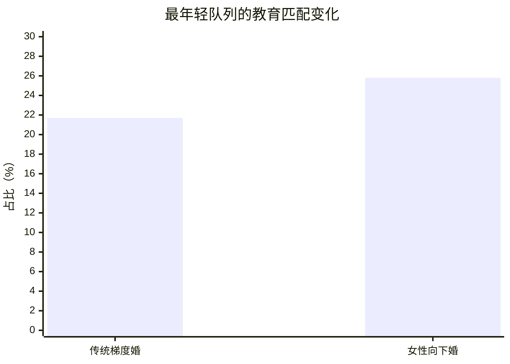
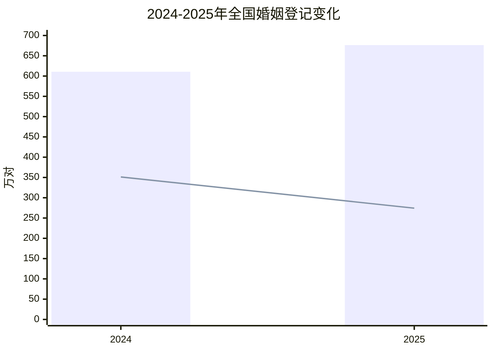

# 男的不贪财，女的不好色

####
##### 写在前面：
####

&emsp;&emsp;说出来你可能不信，

&emsp;&emsp;如果把今天中国婚姻市场理解成一个单纯的“年轻人不想结婚”故事，可能会漏掉更关键的结构性背景。真正的问题是，婚姻市场已经不只是“结不结”的问题，而是正在出现明显的**代际错配**: 出生端长期偏高的性别比，把男多女少的压力一路传导到了适婚年龄；与此同时，女性受教育程度提升、经济独立增强、晚婚观念普及，又改变了原有的配对逻辑。于是，00后、90后、80后看到的婚恋世界，并不是同一个市场。

&emsp;&emsp;一端是00后女性开始进入登记和婚配阶段，同龄男性却从出生时就明显“超编”；另一端是90后女性的择偶标准越来越接近同质匹配，传统的“男高女低”教育婚配在松动；再往上看，80后和部分90后男性已经承受了更直接的婚姻挤压，尤其在农村、低学历和弱资源地区，这种压力更集中、更难靠个人努力化解。

&emsp;&emsp;所以，这篇文章不想讨论“谁挑剔”“谁剩下”这类情绪化话题，而是想回答三个更现实的问题：**第一，婚姻市场为什么会出现跨代配对？第二，80/90后男性的单身压力到底从哪里来？第三，这种代际错配会带来哪些长期后果？**

## 壹

&emsp;&emsp;国家统计局早已给出过一个非常直白的判断：根据七普口径，**20-40岁的适婚年龄男性比女性多了1752万人，性别比为108.9**[1]。这不是抽象的“男女比例失衡”，而是婚恋市场里最硬的底层约束。只要这个人数差存在，同龄匹配就不可能让所有人都找到位置，必然会有人向上跨代、向下延后，或者最终被挤出婚姻市场。

&emsp;&emsp;更需要注意的是，这个压力不是突然出现的。国家统计局关于人口发展的专题报告提到，“十五”时期中国**出生人口性别比为118.3**，明显高于正常区间[2]。而在《2020年中国儿童人口状况》报告中，儿童人口性别比从1982年的106.2一路升至2015年的118.2，到2020年虽已回落到**113.8**，但失衡并没有消失[3]。换句话说，00后进入婚恋市场时，面对的并不是一个已经修复好的环境，而是过去多年性别失衡的滞后结果。

&emsp;&emsp;这张图里放在一起的并不是完全同口径数据，但它足够说明一个事实：**失衡并没有在出生之后自动消失，而是在年龄推进中以另一种形式留了下来。** 从“多生了多少男孩”，变成“婚配年龄多了多少男性”，再变成婚姻市场上的真实挤压。

&emsp;&emsp;也正因为如此，今天很多人看到的现象，比如00后女生更容易和年长几岁甚至十来岁的男性配对，并不只是个人偏好变化，更是人口结构把市场硬生生挤出来的结果。每一个年龄层的配对选择，都被前一阶段的人口结构悄悄设了边界。

## 贰

&emsp;&emsp;说“00后女生上嫁80/90后”，如果只当成某种网络标签，会显得很夸张；但如果放进人口结构里，这件事其实并不难理解。00后女性开始进入婚姻登记时，同龄男性人数本来就更充裕，而年纪更大的90后、部分80后男性则处在“婚姻库存”尚未完全消化的阶段。于是，年轻女性向上匹配，和年龄更大的男性形成婚配，并不是偶发，而是结构挤压下的自然结果。

&emsp;&emsp;这里有一个容易被忽视的细节：公开官方统计并没有持续发布“按出生年代、按性别拆开的全国结婚登记明细”，所以网络上流传的“00后男生登记很少、女生明显更多”之类说法，更多只能被看作阶段性观察，而不是稳定的全国硬口径。**但即使不依赖这些网传数字，仅凭适婚年龄男性多出1752万人这一条，也足以解释为什么00后女性更容易发生跨龄匹配。**

&emsp;&emsp;和00后相比，90后婚配模式的变化并不主要体现在“年龄差突然变大”，而更体现在**匹配逻辑本身变了**。卿石松基于CFPS 2010-2020年数据整理出的12523对夫妻样本显示，在最年轻的出生队列中，传统“梯度婚”持续下降，而**女性向下婚比例升至25.8%，已高于梯度婚的21.7%**[4]。这意味着，至少在教育维度上，年轻一代女性已经不再完全遵循“必须找学历更高的男性”这套旧规则。

&emsp;&emsp;这件事非常重要。它说明90后婚姻并没有简单走向“人人都嫁更年长、更强势的男性”，相反，很多90后女性更接受教育相近、生活方式相近，甚至学历略低于自己的伴侣。**年龄差未必更大，但教育和价值观的同质匹配变得更重要了。**

&emsp;&emsp;从这个角度看，今天的婚姻市场其实已经分成了两层：一层是更接近传统逻辑、资源导向更强、城乡差异更明显的跨龄婚配；另一层是更强调教育、城市生活方式和情感兼容性的同代婚配。00后和90后之所以呈现不同婚恋景观，不是因为一代人突然“变了”，而是她们进入市场时，所面对的供需结构和社会规则本来就不同。

## 叁

&emsp;&emsp;很多关于“剩男”的讨论，喜欢把问题缩成个人能力问题，比如收入不够、性格不好、不够会说话。但从人口学角度看，80/90后男性的单身压力首先是**结构性挤压**。总量上，适婚年龄男性多于女性；匹配上，部分年轻女性向上跨龄，进一步吸收了中高年龄段男性需求；而在教育和城市资源维度上，女性又越来越偏向同质匹配。三股力量叠加后，被挤压得最明显的，往往就是资源偏弱的一批男性。

&emsp;&emsp;这种分化在城乡之间尤其明显。城市里，高学历女性虽然也会晚婚，但她们通常并不缺少选择，只是更晚进入婚姻；真正更容易在婚姻市场长期滞留的，常常是农村、县域、低学历、经济条件一般的男性。国家统计局关于儿童人口和出生性别比的报告也提醒过，部分地区的性别失衡更重，由此带来的就是更典型的“婚姻挤压”[3]。

&emsp;&emsp;再加上现实成本的上升，这种挤压会被继续放大。房价、彩礼、婚礼、育儿、教育支出，都在提高结婚门槛。女性初婚年龄推迟，意味着男性如果要竞争同一批婚配资源，往往需要更晚完成经济准备；而当准备周期变长，年纪也随之上移，又会进一步推动跨龄婚配和择偶焦虑。于是很多80/90后男性不是“不想结”，而是越往后拖，越发现自己进入了一个更难的赛道。

&emsp;&emsp;所以，对这一代男性来说，单身并不一定是个人失败。更准确地说，它是人口结构、地域差异、教育分层与高婚育成本叠加后的结果。**有些人输的不是临门一脚，而是一开始就站在了更拥挤的位置上。**

## 肆

&emsp;&emsp;婚姻挤压最直接的后果，是婚姻稳定性和家庭关系都更容易承压。2025年2季度民政统计数据显示，截至上半年全国**结婚登记353.9万对、离婚登记133.1万对**；到2025年4季度累计，**结婚登记676.3万对、离婚登记274.3万对**[5][6]。与2024年全国**结婚610.6万对、离婚351.3万对**相比，2025年结婚有回升，但整体仍处低位区间，婚姻并没有回到过去那种高强度扩张状态[7]。

&emsp;&emsp;这意味着什么？意味着婚姻对很多人来说，已经不再是默认选项，而是一场更谨慎、更昂贵、也更容易后悔的决策。对于被婚姻市场持续挤压的群体而言，彩礼竞争、代际赡养、家庭关系紧张、长期单身后的健康与养老问题，都会在未来更集中地显现出来。

&emsp;&emsp;另一个经常被忽视的问题，是**高龄父亲的生育健康风险**。如果00后女性和更年长的80/90后男性配对占比上升，那么“父龄上移”就是一个不得不面对的后果。既有遗传学研究显示，父亲年龄越大，子代新发突变数量通常越多。Nature 的经典研究指出，父龄上升与后代新发突变数增加密切相关[8]；后续基于多孩家庭的研究也观察到，父龄每增加1岁，后代新发突变数大致会增加**1-2个**[9]。这并不等于“高龄父亲一定带来疾病”，但它意味着风险背景确实在上升。

&emsp;&emsp;在生殖医学层面，越来越多研究也发现男性年龄和精子DNA碎片率、表观遗传改变之间存在关联。关于先进父龄与精子DNA碎片的系统综述指出，男性衰老可能与精子DNA完整性下降相关[10]；2024年的研究则进一步提示，先进父龄在胎盘与既往精子研究中都能观察到与神经发育相关位点的DNA甲基化改变[11]。再结合精神病学和自闭症研究中的长期观察，合理而克制的说法应该是：**父龄上移并非不可生育，但确实值得更早做生育规划、精液质量评估和遗传咨询。**

&emsp;&emsp;也就是说，代际错配不会只停留在“谁和谁结婚”这个层面，它会一路延伸到家庭稳定、养育压力、健康风险和社会保障负担。婚姻看起来像私事，但当它背后站着1752万人的结构性缺口时，它就已经不是纯粹的私事了。

## 伍

&emsp;&emsp;如果承认今天的婚姻问题有很大一部分是结构性的，那么解决思路也不能停留在责怪个体。对年轻人来说，最现实的建议不是“赶紧结婚”，而是尽量把婚恋和生育决策前移到**理性规划**层面: 能在身体状态、经济条件、职业节奏更平衡时完成婚育，当然更好；如果确实要延后，也应该把生育健康评估纳入计划，而不是只把年龄当成一个抽象数字。

&emsp;&emsp;对父母一代而言，也许更需要放下那种“只要结了就行”的焦虑。结构性错配意味着，不是每个年龄段的人都还能按照上一代的节奏完成婚育。催婚有时并不能解决问题，只会把个体推入更仓促、质量更低的关系里。真正有帮助的，是在住房、育儿支持、双方家庭边界、地区流动上提供更具体的支持。

&emsp;&emsp;对政策层面来说，问题同样不能只理解成“鼓励结婚生孩子”这么简单。出生人口性别比的长期纠偏、对女性教育与就业的平等保护、对高彩礼和过度婚嫁成本的治理、对农村和弱资源地区婚姻挤压的持续关注，以及更普惠的生育和托育支持，都是同一张答卷上的题目。只抓其中一项，效果都有限。

&emsp;&emsp;婚姻从来不只是两个人的浪漫选择，它也是人口结构、性别观念、教育机会和社会成本的综合镜像。今天我们看到的00后跨龄婚、90后同龄匹配和80/90后男性单身潮，归根到底都不是某一代人的道德问题，而是一个时代在人口与社会转型中的真实回声。

&emsp;&emsp;与其互相嘲讽，不如承认现实：**这不是谁“输给了爱情”，而是婚姻市场本身变了。**

> [!TIP] 参考文献
> [1] 国家统计局. 国家统计局新闻发言人就2021年4月份国民经济运行情况答记者问[EB/OL]. 2021-05-17. https://www.stats.gov.cn/sj/sjjd/202302/t20230202_1896489.html.  
> [2] 国家统计局. “十五”时期我国人口保持低速增长[EB/OL]. https://www.stats.gov.cn/zt_18555/ztfx/15cj/202303/t20230301_1920492.html.  
> [3] 国家统计局. 2020年中国儿童人口状况[EB/OL]. https://www.stats.gov.cn/zs/tjwh/tjkw/tjzl/202304/P020230419425666818737.pdf.  
> [4] 卿石松. 女性教育提升与生育行为变迁: 基于夫妻匹配视角的研究[J]. 社会学研究, 2024(2): 179-202.  
> [5] 中华人民共和国民政部. 2025年2季度民政统计数据[EB/OL]. https://www.mca.gov.cn/mzsj/xzqh/2025/202502tjsj.htm.  
> [6] 中华人民共和国民政部. 2025年4季度民政统计数据[EB/OL]. https://www.mca.gov.cn/mzsj/xzqh/2025/202504tjsj.htm.  
> [7] 中华人民共和国民政部. 2024年民政事业发展统计公报[EB/OL]. 2025-07-30. https://www.mca.gov.cn/n1288/n1294/n1554/c1662004999980006190/content.html.  
> [8] Kong A, Frigge M L, Masson G, et al. Rate of de novo mutations and the importance of father's age to disease risk[J]. Nature, 2012, 488: 471-475. https://www.nature.com/articles/nature11396.  
> [9] Jonsson H, Sulem P, Kehr B, et al. Parental influence on human germline de novo mutations in 1,548 trios[J]. Nature, 2017, 549: 519-522. https://www.nature.com/articles/nature24018.  
> [10] Johnson S L, Dunleavy J, Gemmell N J, et al. Advanced Paternal Age and Sperm DNA Fragmentation: A Systematic Review[J]. World Journal of Men's Health, 2021, 39(1): 104-115. https://pubmed.ncbi.nlm.nih.gov/33987998/.  
> [11] Dube-Linteau A, et al. Advanced Paternal Age Impacts Common Loci in the Sperm and Placenta DNA Methylomes[J/OL]. Clinical Epigenetics, 2024. https://pubmed.ncbi.nlm.nih.gov/41159265/
