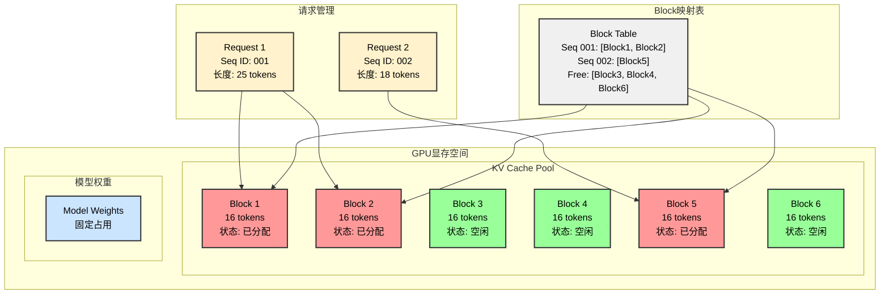

# vLLM学习笔记1 - Ray与vLLM架构深入理解

> **版本说明**: 本文基于 vLLM 0.2.7 版本进行分析  
> **源码位置**: 相关代码主要位于 `vllm/engine/` 和 `vllm/worker/` 目录下

## Ray框架介绍

### Ray是什么

Ray是一个开源的分布式计算框架，专门为机器学习和AI工作负载设计。它提供了简单的API来构建和运行分布式应用程序。

### Ray中的有状态和无状态

#### 无状态服务
- **特点**: 每次请求都是独立的，不依赖之前的状态
- **示例**: HTTP API服务，每个请求处理完就结束

#### 有状态(Worker)服务  
- **特点**: 需要维护内部状态，请求之间有依赖关系
- **优势**: 可以缓存数据，避免重复计算
- **示例**: 数据库连接池，模型推理服务(需要保持模型在内存中)

在vLLM中，Worker节点就是典型的**有状态服务**，因为它们需要：
- 在内存中保持加载的模型
- 维护KV Cache状态
- 跟踪正在处理的请求状态

## vLLM的作用与价值

### 主要作用
1. 专门优化大语言模型的推理速度
2. 通过PagedAttention技术显著减少内存占用
3. 支持动态批处理，提高GPU利用率
4. 支持多GPU和多节点部署

### 核心优势
- **PagedAttention**: 将注意力机制的KV Cache分页管理，类似操作系统的虚拟内存
- **连续批处理**: 动态调整批大小，无需等待整个批次完成
- **零拷贝**: 减少不必要的数据复制操作

### KV Cache显存分配机制

在传统的Transformer推理中，KV Cache需要预先分配连续的显存空间，这会造成大量的内存浪费。vLLM通过PagedAttention技术，将KV Cache分割成固定大小的block块进行管理。

#### Block分配原理
####  



#### 关键特性说明

1. **固定Block大小**: 每个Block通常包含16个token的KV Cache
2. **动态分配**: 根据序列长度动态分配所需的Block数量
3. **非连续存储**: Block在物理内存中可以不连续，通过映射表管理
4. **高效回收**: 请求完成后立即回收Block，供其他请求使用

#### 内存利用率对比

| 方案 | 内存预分配 | 实际使用率 | 浪费率 |
|------|------------|------------|--------|
| 传统方案 | 最大序列长度 | 20-30% | 70-80% |
| PagedAttention | 按需分配 | 90-95% | 5-10% |

#### Block管理的具体流程

```python
# 位置: vllm/core/block_manager.py
class BlockManager:
    def allocate_blocks(self, sequence_length):
        """为序列分配所需的Block"""
        blocks_needed = math.ceil(sequence_length / self.block_size)
        allocated_blocks = []
        
        for _ in range(blocks_needed):
            if self.free_blocks:
                block = self.free_blocks.pop()
                allocated_blocks.append(block)
            else:
                # 内存不足，触发抢占机制
                self.preempt_sequences()
        
        return allocated_blocks
    
    def free_blocks(self, sequence_id):
        """释放序列占用的Block"""
        blocks = self.sequence_to_blocks[sequence_id]
        self.free_blocks.extend(blocks)
        del self.sequence_to_blocks[sequence_id]
```

这种设计的优势：
- **内存碎片化最小**: 固定大小的Block避免了内存碎片
- **动态扩展**: 序列可以根据需要动态申请更多Block
- **共享机制**: 多个序列可以共享相同的prefix Block（如系统提示词）

## vLLM运作方式详解

### 整体架构流程

```
用户请求 → LLMEngine → Scheduler → Workers → GPU推理 → 结果返回
```

### 详细运作步骤

1. `LLMEngine`接收用户的文本生成请求
2. `Scheduler`决定哪些请求可以被处理
3. 为请求分配GPU内存和计算资源
4. 多个`Worker`并行执行推理任务
5. 收集各Worker的输出并返回给用户

## 调度器(Scheduler)详解

### 调度器的核心职责

调度器是vLLM的"大脑"，主要负责：

#### 1. 请求管理
```python
# 位置: vllm/engine/llm_engine.py
class LLMEngine:
    def __init__(self):
        self.scheduler = Scheduler(...)
```

#### 2. 资源调度策略
1. 跟踪可用的GPU内存
2. 决定哪些请求可以组成一个批次
3. 根据请求的优先级和到达时间排序


### 调度算法核心逻辑

```python
# 简化的调度逻辑示例
def schedule_requests(self):
    # 1. 检查可用资源
    available_memory = self.get_available_memory()
    
    # 2. 选择可执行的请求
    executable_requests = []
    for request in self.waiting_requests:
        if self.can_allocate(request, available_memory):
            executable_requests.append(request)
    
    # 3. 返回调度结果
    return executable_requests
```

## Worker的作用与机制

### Worker的核心功能

Worker是vLLM的"执行者"，每个Worker负责：

#### 1. 模型加载与管理
```python
# 位置: vllm/worker/worker.py
class Worker:
    def __init__(self):
        self.model_runner = ModelRunner(...)
        self.cache_engine = CacheEngine(...)
```

#### 2. 推理执行
- **前向传播**: 执行模型的前向计算
- **KV缓存管理**: 管理注意力机制的键值缓存
- **内存分配**: 为每个请求分配必要的内存空间

#### 3. 状态维护
- **请求状态跟踪**: 记录每个请求的处理进度
- **缓存状态管理**: 维护PagedAttention的页面状态
- **错误处理**: 处理推理过程中的异常情况

### Worker的工作流程

1. **初始化**: 加载模型权重，初始化缓存引擎
2. **接收任务**: 从调度器接收批处理任务
3. **执行推理**: 并行处理批次中的所有请求
4. **返回结果**: 将推理结果返回给引擎

## 关键代码文件位置

### 主要源码文件结构

```
vllm/
├── engine/
│   ├── llm_engine.py          # 主引擎，协调整个推理流程
│   └── async_llm_engine.py    # 异步版本的引擎
├── core/
│   ├── scheduler.py           # 调度器核心逻辑
│   └── block_manager.py       # 内存块管理器
├── worker/
│   ├── worker.py              # Worker基类实现
│   └── model_runner.py        # 模型运行器
└── attention/
    └── backends/              # PagedAttention实现
```

### 重要文件说明

- **`vllm/engine/llm_engine.py`**: 整个系统的入口点和协调中心
- **`vllm/core/scheduler.py`**: 实现了复杂的请求调度算法
- **`vllm/worker/worker.py`**: Worker的具体实现逻辑
- **`vllm/core/block_manager.py`**: PagedAttention的内存管理实现

## 总结

vLLM通过Ray框架实现分布式推理，采用有状态的Worker设计来保持模型和缓存状态。其核心创新在于PagedAttention技术和智能调度系统，大幅提升了大语言模型的推理效率和资源利用率。

